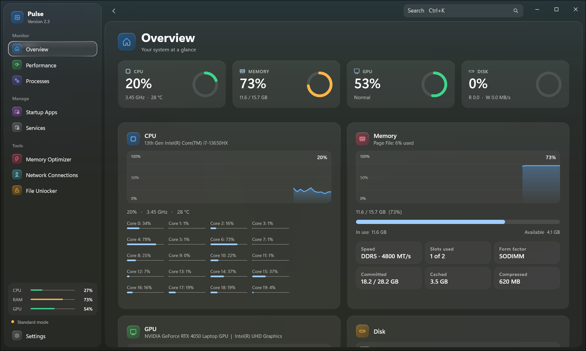
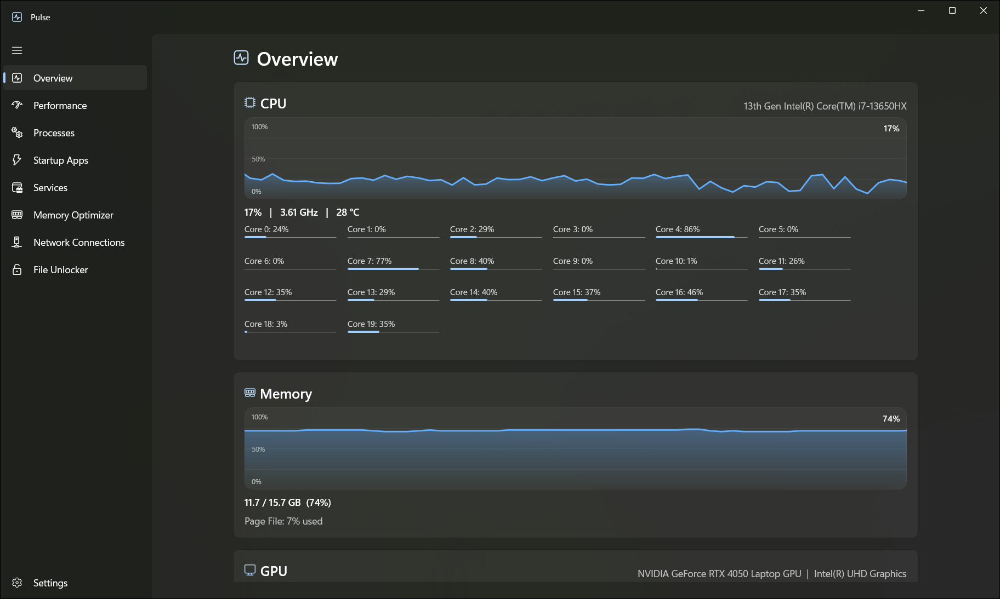

<div align="center">

#  Pulse — System Monitor

**A beautiful, modern task manager & system monitor for Windows 11, built with WinUI 3 and .NET 8.**

[⬇️ Download Pulse](https://dl1.wl-std.com/Pulse-2.3.1-Setup.exe) · [🌐 pouriyaparniyan.ir](https://pouriyaparniyan.ir)

*Open source — read the code, audit it, build it yourself.*<br><br>
  
</div>

---

## 📸 Screenshots

**✨ New design (v2.3)** — glass sidebar, live dashboard, global search



**🪟 Classic design** — prefer the original look? Switch back anytime in Settings



---

## ✨ Features

- **✨ Brand-new design (v2.3)** — glass sidebar with fluid animations, live dashboard, **Ctrl+K global search**, welcome tour — or switch back to the **classic design** in Settings
- **Overview** — CPU, RAM, GPU, disk and network at a glance with live graphs
- **Performance** — deep per-component view:
  - CPU total + per-core graphs, live clock speed
  - Memory, Disk (active time + transfer rate), Network (download/upload)
  - GPU with engine graphs (3D / Copy / Video Decode / Processing) and temperature
  - **Sensors** — temperature, fan, voltage, power and clocks via LibreHardwareMonitor (fully local & offline)
  - History mode — scroll back through the last 10 minutes / 1 hour
  - Top 3 heaviest processes under every graph
- **Processes** — grouped like Windows Task Manager (Apps / Background / Windows):
  - End task (with a satisfying sound), Suspend / Resume, Set priority
  - **Efficiency mode** (EcoQoS) with a green leaf indicator, just like Windows
  - Per-process **network usage** (admin), disk, GPU, memory, CPU
  - Search, sort, advanced filters, copy details, **export to CSV**
- **Startup Apps** — enable/disable with estimated boot impact and real app icons
- **Services** — browse and manage Windows services
- **Memory Optimizer** — really frees RAM and shows the honest result (free before → after), automatic cleanup, biggest memory users
- **Network Connections** — every TCP/UDP connection and open port with its owning process, live refresh, search and End process
- **File Unlocker** — drag a file or folder in to see which processes are locking it, then end them or unlock all at once
- **Desktop Widget** — small always-on-top glass card with live CPU / RAM / GPU gauges, network speed and temperature
- **System Tray** — live mini-graphs in the tray, fully customizable per icon (color, background, size)
- **Usage alarms** — Windows notification when CPU / RAM / temperature crosses your limit
- **7 themes** (Mica, Liquid Glass, Midnight, Aurora, OLED, Paper…) + **any accent color** (wheel / hex) applied to the whole app
- **5 languages** — English, فارسی (RTL), Русский, Azərbaycan dili, Türkçe
- **Hardware details** — RAM type/speed/slots, CPU cores/threads/cache/virtualization, real GPU VRAM & driver, disk brand/NVMe/PCIe generation & health
- **Auto-update** — checks GitHub Releases quietly at launch, shows what's new, downloads and asks you to install

## 📥 Installation

## Option 1 — Winget (recommended)

```powershell
winget install wl-std.pulse
``` 

### Option 2 — Manual download

1. Download: **[Pulse-2.3.1-Setup.exe](https://dl1.wl-std.com/Pulse-2.3.1-Setup.exe)**
2. Run it — it will ask for administrator access once (to trust the certificate and install)
3. Done. Find **Pulse** in the Start menu, plus a shortcut on your desktop.

> Requires Windows 10 version 1809 or newer (Windows 11 recommended).
> Some features (per-process network, some sensors) need **Run as administrator**.

## 🔒 Privacy

Pulse is fully local. No telemetry, no accounts, no data ever leaves your machine.
The only network request is the optional update check against this project's GitHub Releases.

## 📄 License

Source-available: you may read, audit and build the code yourself, but you may not
redistribute it under your own name without permission. See [LICENSE](LICENSE).

## 🛠️ Building from source

### Prerequisites

| Tool | Version |
|---|---|
| Windows | 10 (1809+) or 11 |
| [.NET SDK](https://dotnet.microsoft.com/download/dotnet/8.0) | 8.0+ |
| Visual Studio 2022 *(optional)* | with **Windows App SDK / WinUI** workload |

### Steps

**1. Clone the repository**

```bash
git clone https://github.com/pooriyayt/pulse-system-monitor.git
cd pulse-system-monitor
```

**2. Build & run (CLI)**

```bash
dotnet build Pulse/Pulse.csproj -p:Platform=x64
```

Or open `Pulse/Pulse.sln` in Visual Studio, set platform to **x64**, press **F5**.

**3. Build the single-file installer**

```bash
build-installer.bat
```

This will:
- build a signed Release MSIX package
- create a self-signed certificate on first run
- produce a single `Installer/Pulse-<version>-Setup.exe`

---

<div dir="rtl" align="center">

# پالس — مانیتور سیستم

**یک تسک‌منیجر و مانیتور سیستم مدرن و زیبا برای ویندوز ۱۱، ساخته‌شده با WinUI 3 و .NET 8**

[⬇️ دانلود Pulse](https://dl1.wl-std.com/Pulse-2.3.1-Setup.exe) · [🌐 pouriyaparniyan.ir](https://pouriyaparniyan.ir)

*متن‌باز — کد را بخوانید، بررسی کنید و خودتان بیلد بگیرید.*

</div>

<div dir="rtl">

## 📸 تصاویر

**✨ طراحی جدید (نسخه‌ی ۲.۳)** — منوی شیشه‌ای، داشبورد زنده، جستجوی سراسری

</div>


<div dir="rtl">

**🪟 طراحی کلاسیک** — ظاهر قبلی را دوست دارید؟ هر زمان از تنظیمات برگردید

</div>


<div dir="rtl">

## ✨ امکانات

- **✨ طراحی کاملاً جدید (نسخه‌ی ۲.۳)** — منوی شیشه‌ای با انیمیشن‌های روان، داشبورد زنده، **جستجوی سراسری Ctrl+K**، تور معرفی — یا برگشت به **طراحی کلاسیک** از تنظیمات
- **نمای کلی** — CPU، رم، GPU، دیسک و شبکه در یک نگاه با گراف زنده
- **پرفورمنس** — نمای عمیق هر قطعه:
  - گراف کلی + تک‌تک هسته‌های CPU با سرعت لحظه‌ای
  - حافظه، دیسک (زمان فعال + نرخ انتقال)، شبکه (دانلود/آپلود)
  - GPU با گراف موتورها (3D / Copy / Video Decode / Processing) و دما
  - **سنسورها** — دما، فن، ولتاژ، توان و کلاک با LibreHardwareMonitor (کاملاً لوکال و آفلاین)
  - حالت تاریخچه — پیمایش ۱۰ دقیقه / ۱ ساعت گذشته
  - ۳ پردازه‌ی پرمصرف زیر هر گراف
- **پردازه‌ها** — گروه‌بندی مثل تسک‌منیجر ویندوز (برنامه‌ها / پس‌زمینه / ویندوز):
  - End task (با صدای رضایت‌بخش!)، فریز/آنفریز، تغییر اولویت
  - **حالت بهره‌وری** (EcoQoS) با برگ سبز، دقیقاً مثل ویندوز
  - مصرف **شبکه‌ی هر پردازه** (ادمین)، دیسک، GPU، رم، CPU
  - جستجو، مرتب‌سازی، فیلتر پیشرفته، کپی جزئیات، **خروجی CSV**
- **برنامه‌های استارتاپ** — روشن/خاموش با تخمین تأثیر روی بوت و آیکون واقعی برنامه‌ها
- **سرویس‌ها** — مدیریت سرویس‌های ویندوز
- **بهینه‌ساز حافظه** — واقعاً رم را آزاد می‌کند و نتیجه‌ی صادقانه نشان می‌دهد (آزاد قبل ← بعد)، پاک‌سازی خودکار، پرمصرف‌ترین برنامه‌ها
- **اتصال‌های شبکه** — همه‌ی اتصال‌های TCP/UDP و پورت‌های باز همراه با پردازه‌ی مالک، بروزرسانی زنده، جستجو و بستن پردازه
- **آزادساز فایل** — فایل یا پوشه را بکشید تا ببینید چه پردازه‌ای قفلش کرده و همان‌جا آزادش کنید
- **ویجت دسکتاپ** — کارت شیشه‌ای کوچک همیشه-رو با گیج زنده‌ی CPU / رم / GPU، سرعت شبکه و دما
- **سیستم تری** — mini-گراف زنده در تری، شخصی‌سازی کامل هر آیکون (رنگ، پس‌زمینه، اندازه)
- **آلارم مصرف** — نوتیفیکیشن ویندوز وقتی CPU / رم / دما از حد شما رد شود
- **۷ تم** (Mica، Liquid Glass، Midnight، Aurora، OLED، Paper و…) + **هر رنگ اکسنت دلخواه** (چرخ رنگ / هگز) روی کل برنامه
- **۵ زبان** — English، فارسی (RTL)، Русский، Azərbaycan dili، Türkçe
- **جزئیات سخت‌افزار** — نوع/سرعت/اسلات‌های رم، هسته/ترد/کش/مجازی‌سازی CPU، VRAM واقعی و درایور GPU، برند/NVMe/نسل PCIe و سلامت دیسک
- **آپدیت خودکار** — هنگام اجرا بی‌صدا Releaseهای گیت‌هاب را چک می‌کند، تغییرات را نشان می‌دهد، دانلود و برای نصب از شما می‌پرسد

## 📥 نصب

### روش اول — Winget (پیشنهادی)

```powershell
winget install wl-std.pulse
```

### روش دوم — دانلود دستی

۱. دانلود: **[Pulse-2.3.1-Setup.exe](https://dl1.wl-std.com/Pulse-2.3.1-Setup.exe)**
۲. اجرایش کنید — یک بار دسترسی ادمین می‌خواهد (برای Trust گواهی و نصب)
۳. تمام! **Pulse** در منوی استارت است و شورتکاتش روی دسکتاپ.

> ویندوز ۱۰ نسخه‌ی 1809 به بالا لازم است (ویندوز ۱۱ پیشنهاد می‌شود).
> بعضی امکانات (شبکه‌ی هر پردازه، برخی سنسورها) به **Run as administrator** نیاز دارند.

## 🔒 حریم خصوصی

پالس کاملاً لوکال است. نه تله‌متری، نه اکانت — هیچ داده‌ای از سیستم شما خارج نمی‌شود.
تنها درخواست شبکه، چک اختیاری آپدیت از Releaseهای گیت‌هاب همین پروژه است.

## 📄 لایسنس

سورس-در-دسترس: می‌توانید کد را بخوانید، بررسی کنید و خودتان بیلد بگیرید، اما بدون اجازه
نمی‌توانید آن را به اسم خودتان منتشر کنید. فایل [LICENSE](LICENSE) را ببینید.

## 🛠️ بیلد گرفتن از سورس

### پیش‌نیازها

| ابزار | نسخه |
|---|---|
| ویندوز | ۱۰ (1809 به بالا) یا ۱۱ |
| [.NET SDK](https://dotnet.microsoft.com/download/dotnet/8.0) | 8.0 به بالا |
| ویژوال استودیو ۲۰۲۲ *(اختیاری)* | با ورک‌لود **Windows App SDK / WinUI** |

### مراحل

**۱. کلون کردن مخزن**

```bash
git clone https://github.com/pooriyayt/pulse-system-monitor.git
cd pulse-system-monitor
```

**۲. بیلد و اجرا از خط فرمان**

```bash
dotnet build Pulse/Pulse.csproj -p:Platform=x64
```

یا فایل `Pulse/Pulse.sln` را در ویژوال استودیو باز کنید، پلتفرم را روی **x64** بگذارید و **F5** بزنید.

**۳. ساخت اینستالر تک‌فایلی**

```bash
build-installer.bat
```

این اسکریپت:
- پکیج MSIX امضاشده‌ی Release می‌سازد
- بار اول گواهی امضا می‌سازد
- یک فایل `Pulse-<version>-Setup.exe` تکی در پوشه‌ی `Installer` تحویل می‌دهد

</div>

---

<div align="center">

**Made with 💚&🍵 by [Pouriya Parniyan](https://pouriyaparniyan.ir)**

</div>
